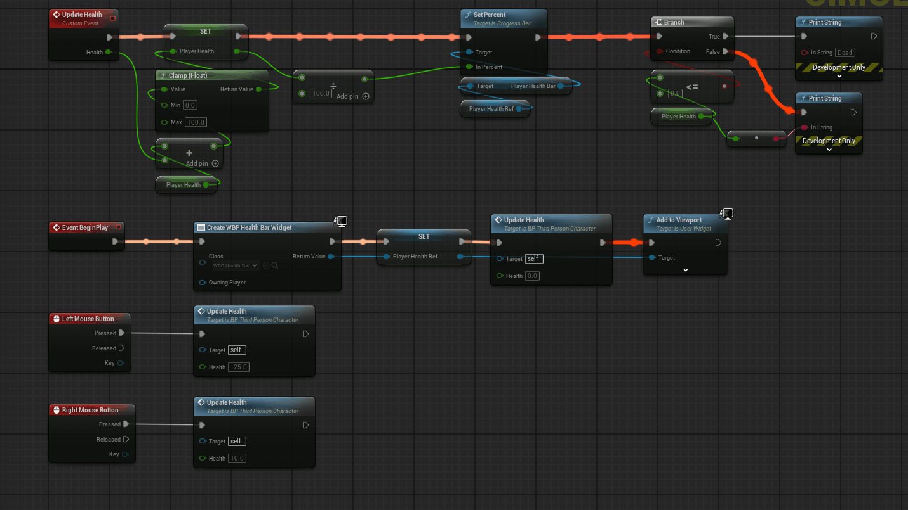
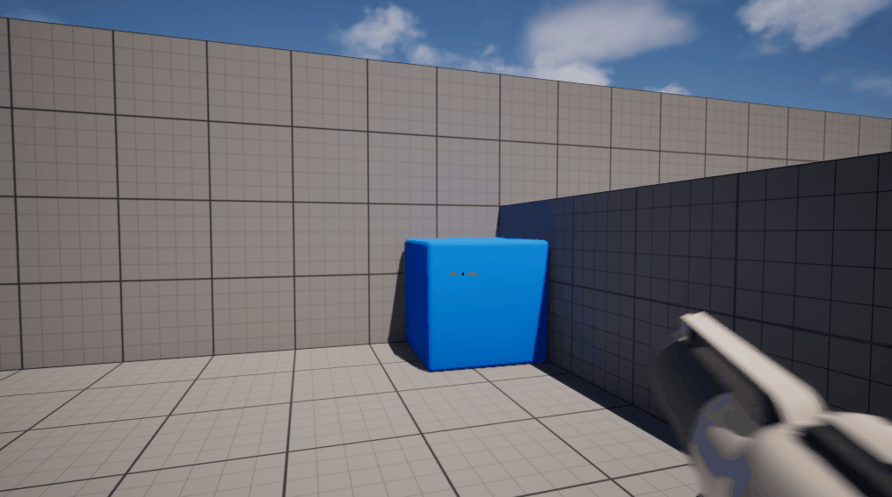
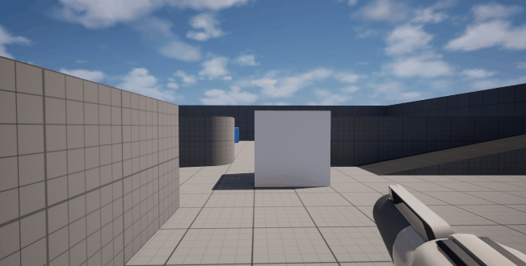

# Project 1 – Scalable Door Interaction System (Blueprint Interfaces)

## 🖼️ Preview

## 🧱 Features

**Blueprint Interface–Driven Interaction**

- Uses a shared `BPI_Interact` interface to decouple interaction logic  
- Any actor can trigger interactions without direct references  
- Enables reuse across doors, buttons, triggers, and future interactables  

**Reusable Door Actor**

- `BP_Door` contains no input logic or knowledge of who activates it  
- Open and Close behavior exposed through custom events  
- Timeline-driven rotation ensures smooth, data-driven motion  

**Button-Based Control System**

- `BP_Button` implements the interaction interface  
- Instance-editable door reference allows flexible level setup  
- FlipFlop logic toggles open and close without duplicated code  

**Centralized Player Interaction**

- Interaction input handled exclusively on the player character  
- Multi-sphere trace detects nearby interactable actors  
- Interface checks ensure only valid actors respond  

## 🚀 Result 

---

A fully scalable interaction system where doors respond to players, buttons, or any future trigger without tight coupling.  
This pattern establishes a clean foundation for expanding interaction mechanics across an entire Unreal Engine project.

# Project 2 – Physics Grab and Rotate Interaction System

## 🖼️ Preview

## 🧱 Features

**Enhanced Input–Driven Interaction**

- Uses Enhanced Input Actions for grab, pitch rotation, and yaw rotation  
- Hold-based grab input allows continuous interaction while pressed  
- Separate axis inputs enable precise object rotation control  

**Camera-Based Line Trace Detection**

- Line trace originates from the first-person camera  
- Adjustable grab distance allows flexible interaction range  
- Any visible component can be detected without hard references  

**Physics Handle Object Manipulation**

- Physics Handle component manages object holding and movement  
- Target location updates every frame to maintain camera offset  
- Rotation preserved and updated incrementally while held  

**Dynamic Object Rotation System**

- Stored rotator tracks current held object orientation  
- Pitch and yaw inputs applied additively per frame  
- Rotation speed exposed for easy tuning and iteration  

**Visual Feedback via Outline Material**

- Simple unlit outline material applied on grab  
- Overlay material clearly communicates interaction state  
- Automatically removed when the object is released  

**Flexible Physics Test Actors**

- Supports static and skeletal meshes  
- Continuous Collision Detection enabled for stability  
- Physics-driven behavior mirrors familiar first-person interaction systems  

## 🚀 Result

A fully functional physics-based grab and rotate system that allows players to pick up, inspect, and manipulate objects in real time.  
This project establishes a strong foundation for expanding interaction mechanics such as throwing, snapping, or context-aware object use.

--- 

# Project 3 – Chaos Fracture Interior Material Setup

## 🖼️ Preview

## 🧱 Features

**Chaos Geometry Collection Workflow**

- Static mesh converted into a Geometry Collection using Fracture Mode  
- Uniform Fracture applied to generate clean, testable fracture pieces  
- Bone colors disabled for accurate material preview  

**Interior vs Exterior Material Separation**

- Geometry Collection material slots expanded to support multiple materials  
- Slot 0 reserved for exterior surface material  
- Slot 1 dedicated to interior fracture faces  

**Interior Material Visualization**

- Custom bright emissive material created for clear interior face visibility  
- Explode Amount used during setup to preview internal surfaces  
- Ensures interior faces are visually distinct during fracture testing  

**Material Assignment to Internal Faces**

- Interior bones selected via Fracture Hierarchy  
- Assign Material utility used with Material Index set to interior slot  
- Material applied to **Only Internal Faces** for correct separation  

## 🚀 Result

A properly configured Chaos Geometry Collection where fractured interior faces use a dedicated material while exterior surfaces remain unchanged.  
This setup ensures believable destruction visuals and establishes a reliable workflow for advanced Chaos-based destruction systems in Unreal Engine 5.

--- 

# Project 4 – Event-Driven Health and Death System (UI + Gameplay)

## 🖼️ Preview

## 🧱 Features

**Event-Driven Health Architecture**

- Player health managed through a single `UpdateHealth` custom event  
- Supports both damage and healing via posit

--- 

# Project 5 – Asset-Free UMG Crosshair System

## 🖼️ Preview

## 🧱 Features

**Procedural UMG Crosshair Design**

- Crosshair built entirely using UMG Border widgets  
- No textures, materials, or external assets required  
- Fully resolution-independent and DPI-safe  

**Centered Canvas-Based Layout**

- Canvas Panel used for precise screen-space positioning  
- Center dot anchored and aligned to screen center  
- Alignment values ensure consistent behavior across resolutions  

**Rounded Border Styling**

- Border widgets configured with Rounded Box draw mode  
- Clean, soft visual appearance without image dependencies  
- Color and opacity easily adjustable per element  

**Modular Crosshair Wings**

- Horizontal wings built as independent Border widgets  
- Mirrored alignment used for left and right symmetry  
- Size, spacing, and transparency exposed for quick iteration  

**Begin Play UI Initialization**

- Crosshair widget created on Event Begin Play  
- Added directly to the viewport without weapon dependency  
- Reference stored for future dynamic behavior or removal  

**Manual Aim Alignment Support**

- Entire crosshair adjustable via Canvas Slot positioning  
- Enables visual alignment with projectile spawn direction  
- Provides a flexible baseline for weapon-specific tuning  

## 🚀 Result

A lightweight, extensible crosshair system built entirely with UMG primitives.  
This project establishes a clean foundation for debugging, prototyping, or extending into dynamic, weapon-aware crosshair behavior without relying on image assets.

--- 

# Project 6 – Chaos Destruction Anchor Fields

## 🖼️ Preview

## 🧱 Features

**Chaos Destruction Setup**

- Geometry Collection created from a scaled cube mesh
- Uniform fracture applied to produce clean, readable break patterns
- Bone color visualization disabled for clearer destruction results

**Projectile-Based Strain Application**

- First Person projectile modified to spawn a Chaos Master Field on impact
- Strain field spawned at hit location using impact point transform
- High strain magnitude applied to guarantee fracture for demonstration
- Field triggered immediately before projectile cleanup

**Anchor Field Stabilization**

- Built-in FS_AnchorField_Generic placed directly in the level
- Anchor Field scaled and positioned to overlap only part of the Geometry Collection
- Box, sphere, and plane shapes supported for different constraint behaviors
- Anchor Field explicitly assigned in the Geometry Collection Initialization Fields array

**Controlled Destruction Behavior**

- Anchored fracture pieces remain fixed after break
- Unanchored sections respond to gravity and physics forces
- Prevents full structural collapse while preserving fracture detail
- Demonstrates how Chaos constraints affect post-fracture motion

## 🚀 Result

Chaos Destruction no longer collapses entire structures by default.  
Anchor Fields provide predictable, grounded destruction by defining which fracture pieces stay fixed and which are allowed to move, making large environmental assets feel intentional, stable, and physically believa
